# OpenSearch Benchmark Automation - Architecture Wiki

## Table of Contents
1. [System Overview](#system-overview)
2. [Architecture Diagram](#architecture-diagram)
3. [Execution Flow State Diagram](#execution-flow-state-diagram)
4. [Component Interactions](#component-interactions)
5. [Data Flow](#data-flow)
6. [Configuration System](#configuration-system)
7. [Telemetry Collection Flow](#telemetry-collection-flow)
8. [Directory Structure](#directory-structure)

---

## System Overview

The OpenSearch Benchmark Automation is a comprehensive testing framework that orchestrates vector search engine benchmarks across multiple engines (FAISS, JVector, Lucene) with integrated profiling, metrics collection, and telemetry diagnostics.

### Key Components

```
┌─────────────────────────────────────────────────────────────────┐
│                    Benchmark Automation System                  │
├─────────────────────────────────────────────────────────────────┤
│                                                                 │
│  ┌──────────────┐  ┌──────────────┐  ┌──────────────┐           │
│  │ Config       │  │ Dataset      │  │ Benchmark    │           │
│  │ Manager      │──│ Manager      │──│ Executor     │           │
│  └──────────────┘  └──────────────┘  └──────────────┘           │
│         │                                   │                   │
│         │                                   │                   │
│  ┌──────▼──────┐  ┌──────────────┐  ┌───────▼──────┐            │
│  │ Profiling   │  │ Metrics      │  │ Telemetry    │            │
│  │ Manager     │  │ Collector    │  │ Collector    │            │
│  └─────────────┘  └──────────────┘  └──────────────┘            │ 
│         │                 │                   │                 │
│         └─────────────────┴───────────────────┘                 │
│                           │                                     │
│                  ┌────────▼────────┐                            │
│                  │ Dashboard       │                            │
│                  │ Generator       │                            │
│                  └─────────────────┘                            │
│                                                                 │
└─────────────────────────────────────────────────────────────────┘
```

---

## Architecture Diagram

```
┌─────────────────────────────────────────────────────────────────────────┐
│                           USER INTERFACE                                │
├─────────────────────────────────────────────────────────────────────────┤
│                                                                         │
│  ./run-benchmark.sh  OR  ./run-benchmark-parallel.sh                    │
│         │                           │                                   │
│         └───────────┬───────────────┘                                   │
│                     │                                                   │
│              ┌──────▼──────┐                                            │
│              │   CLI Args  │                                            │
│              │  Parsing    │                                            │
│              └──────┬──────┘                                            │
│                     │                                                   │
└─────────────────────┼───────────────────────────────────────────────────┘
                      │
┌─────────────────────▼─────────────────────────────────────────────────────┐
│                      CONFIGURATION LAYER                                  │
├───────────────────────────────────────────────────────────────────────────┤
│                                                                           │
│  ┌─────────────────┐         ┌─────────────────┐                          │
│  │ cluster.yaml    │         │ datasets.yaml   │                          │
│  ├─────────────────┤         ├─────────────────┤                          │
│  │ • Endpoint      │         │ • Dataset specs │                          │
│  │ • Auth          │         │ • Dimensions    │                          │
│  │ • Profiling     │         │ • Formats       │                          │
│  │ • Metrics       │         │ • Workloads     │                          │
│  │ • Telemetry     │         │ • Parameters    │                          │
│  └────────┬────────┘         └────────┬────────┘                          │
│           │                           │                                   │
│           └───────────┬───────────────┘                                   │
│                       │                                                   │
│                ┌──────▼──────┐                                            │
│                │ Config      │                                            │
│                │ Manager     │                                            │
│                └──────┬──────┘                                            │
│                       │                                                   │
└───────────────────────┼───────────────────────────────────────────────────┘
                        │
┌───────────────────────▼────────────────────────────────────────────────────┐
│                      EXECUTION LAYER                                       │
├────────────────────────────────────────────────────────────────────────────┤
│                                                                            │
│  ┌──────────────────────────────────────────────────────────────────┐      │
│  │                    Benchmark Executor                            │      │
│  ├──────────────────────────────────────────────────────────────────┤      │
│  │                                                                  │      │
│  │  1. Initialize Components                                        │      │
│  │     ├─ Telemetry Collector                                       │      │
│  │     ├─ Profiling Manager                                         │      │
│  │     ├─ Metrics Collector                                         │      │
│  │     └─ Server Log Collector                                      │      │
│  │                                                                  │      │
│  │  2. Pre-Run Telemetry (if enabled)                               │      │
│  │     ├─ Cluster state snapshot                                    │      │
│  │     ├─ Server logs (1000 lines)                                  │      │
│  │     └─ GKE metrics snapshot                                      │      │
│  │                                                                  │      │
│  │  3. Execute Scenarios                                            │      │
│  │     ├─ Index Creation                                            │      │
│  │     ├─ Bulk Ingest (with profiling & metrics)                    │      │
│  │     ├─ Force Merge (with profiling & metrics)                    │      │
│  │     └─ Search Tests (parameter sweeps)                           │      │
│  │                                                                  │      │
│  │  4. Post-Run Telemetry (if enabled)                              │      │
│  │     ├─ Cluster state snapshot                                    │      │
│  │     ├─ Server logs (5000 lines)                                  │      │
│  │     └─ GKE metrics with time window                              │      │
│  │                                                                  │      │
│  │  5. Generate Dashboards                                          │      │
│  │     ├─ Per-scenario HTML reports                                 │      │
│  │     ├─ Comparison dashboards                                     │      │
│  │     └─ Index page with summary                                   │      │
│  │                                                                  │      │
│  └──────────────────────────────────────────────────────────────────┘      │
│                                                                            │
└─────────────────────────────────────────────────────────────────────────-──┘
                                    │
┌───────────────────────────────────▼──────────────────────────────────────────┐
│                         KUBERNETES LAYER                                     │
├──────────────────────────────────────────────────────────────────────────────┤
│                                                                              │
│  ┌────────────────────┐         ┌────────────────────┐                       │
│  │ Benchmark Client   │         │ OpenSearch Cluster │                       │
│  │ Pod                │────────▶│ (FAISS/JVector/    │                       │
│  │                    │         │  Lucene)           │                       │
│  │ • opensearch-      │         │                    │                       │
│  │   benchmark CLI    │         │ • Data Nodes       │                       │
│  │ • Workloads        │         │ • Cluster Managers │                       │
│  │ • Test Data        │         │                    │                       │
│  └────────────────────┘         └────────────────────┘                       │
│           │                              │                                   │
│           │                              │                                   │
│  ┌────────▼──────────┐         ┌────────▼────────┐                           │
│  │ kubectl exec      │         │ kubectl logs    │                           │
│  │ (Run benchmarks)  │         │ (Collect logs)  │                           │
│  └───────────────────┘         └─────────────────┘                           │
│                                                                              │
└──────────────────────────────────────────────────────────────────────────────┘
                                    │
┌───────────────────────────────────▼──────────────────────────────────────────┐
│                         OUTPUT LAYER                                         │
├──────────────────────────────────────────────────────────────────────────────┤
│                                                                              │
│  results/20260608-003727/                                                    │
│  ├── telemetry-pre-run/                                                      │
│  │   ├── cluster-health.json                                                 │
│  │   ├── server-logs/                                                        │
│  │   └── gke-metrics-snapshot.json                                           │
│  │                                                                           │
│  ├── msmarco-faiss/                                                          │
│  │   ├── scenario-2-bulk-ingest/                                             │
│  │   │   ├── test_run.json                                                   │
│  │   │   ├── results.html                                                    │
│  │   │   ├── gke_metrics.json                                                │
│  │   │   └── profiles/                                                       │
│  │   │       └── cpu_flame_graph_node-0.html                                 │
│  │   └── scenario-3-force-merge/                                             │
│  │                                                                           │
│  ├── telemetry-post-run/                                                     │
│  │   ├── cluster-health.json                                                 │
│  │   ├── server-logs/                                                        │
│  │   ├── gke-metrics.json                                                    │
│  │   └── query-gke-metrics.sh                                                │
│  │                                                                           │
│  └── index.html (Summary Dashboard)                                          │
│                                                                              │
└──────────────────────────────────────────────────────────────────────────────┘
```

---

## Execution Flow State Diagram

```mermaid
graph TD
    %% Node Definitions and Flow Transitions
    Start[Start] --> ParseCLI[Parse CLI Arguments]
    ParseCLI --> LoadConfig[Load Config Files]
    LoadConfig --> ValidateSettings[Validate Settings]
    ValidateSettings --> DisplayConfig[Display Config & Confirm]
    DisplayConfig --> InitComponents[Initialize Components]
    InitComponents --> TelemetryCheck1{Telemetry Enabled?}

    TelemetryCheck1 -->|Yes| CollectPreRun[Collect Pre-Run Telemetry]
    TelemetryCheck1 -->|No| ScenarioBranching{Scenario Type?}
    CollectPreRun --> ScenarioBranching

    ScenarioBranching -->|Index Creation| IndexCreation[Index Creation]
    ScenarioBranching -->|Bulk Ingest| BulkIngest[Bulk Ingest]
    ScenarioBranching -->|Search Tests| SearchTests[Search Tests]

    IndexCreation --> ExecuteBenchmark[Execute Benchmark via kubectl]
    BulkIngest --> ExecuteBenchmark
    SearchTests --> ExecuteBenchmark

    ExecuteBenchmark --> SuccessCheck{Success?}

    SuccessCheck -->|Yes| StopMetrics[Stop Metrics & Profiling]
    SuccessCheck -->|No| CaptureLogs[Capture Error Logs]

    StopMetrics --> DownloadArtifacts[Download Artifacts]
    CaptureLogs --> DownloadArtifacts

    DownloadArtifacts --> GenFlameGraphs[Generate Flame Graphs]
    GenFlameGraphs --> GenMetricsGraphs[Generate Metrics Graphs]
    GenMetricsGraphs --> GenHTMLReport[Generate HTML Report]
    GenHTMLReport --> MoreScenariosCheck{More Scenarios?}

    MoreScenariosCheck -->|Yes| ScenarioBranching
    MoreScenariosCheck -->|No| MoreEnginesCheck{More Engines?}

    MoreEnginesCheck -->|Yes| ScenarioBranching
    MoreEnginesCheck -->|No| TelemetryCheck2{Telemetry Enabled?}

    TelemetryCheck2 -->|Yes| CollectPostRun[Collect Post-Run Telemetry]
    TelemetryCheck2 -->|No| GenComparison[Generate Comparison Dashboard]

    CollectPostRun --> GenComparison
    GenComparison --> GenIndexPage[Generate Index Page]
    GenIndexPage --> Complete[Complete & END]

    %% Styles for Visual Clarity and Palette Balance
    style Start fill:#C8E6C9,stroke:#388E3C,stroke-width:2px,color:#1B5E20
    style Complete fill:#C8E6C9,stroke:#388E3C,stroke-width:2px,color:#1B5E20

    %% Decision Diamonds (Yellow)
    style TelemetryCheck1 fill:#FFF9C4,stroke:#FBC02D,stroke-width:2px,color:#5D4037
    style ScenarioBranching fill:#FFF9C4,stroke:#FBC02D,stroke-width:2px,color:#5D4037
    style SuccessCheck fill:#FFF9C4,stroke:#FBC02D,stroke-width:2px,color:#5D4037
    style MoreScenariosCheck fill:#FFF9C4,stroke:#FBC02D,stroke-width:2px,color:#5D4037
    style MoreEnginesCheck fill:#FFF9C4,stroke:#FBC02D,stroke-width:2px,color:#5D4037
    style TelemetryCheck2 fill:#FFF9C4,stroke:#FBC02D,stroke-width:2px,color:#5D4037

    %% CLI Setup Steps (Soft Blue)
    style ParseCLI fill:#E3F2FD,stroke:#1976D2,stroke-width:1.5px,color:#0D47A1
    style LoadConfig fill:#E3F2FD,stroke:#1976D2,stroke-width:1.5px,color:#0D47A1
    style ValidateSettings fill:#E3F2FD,stroke:#1976D2,stroke-width:1.5px,color:#0D47A1
    style DisplayConfig fill:#E3F2FD,stroke:#1976D2,stroke-width:1.5px,color:#0D47A1
    style InitComponents fill:#E3F2FD,stroke:#1976D2,stroke-width:1.5px,color:#0D47A1

    %% Execution Scenarios & Benchmarks (Teal)
    style IndexCreation fill:#E0F7FA,stroke:#0097A7,stroke-width:1.5px,color:#006064
    style BulkIngest fill:#E0F7FA,stroke:#0097A7,stroke-width:1.5px,color:#006064
    style SearchTests fill:#E0F7FA,stroke:#0097A7,stroke-width:1.5px,color:#006064
    style ExecuteBenchmark fill:#E0F7FA,stroke:#0097A7,stroke-width:2px,color:#006064

    %% Failure Pipeline (Soft Red)
    style CaptureLogs fill:#FFEBEE,stroke:#D32F2F,stroke-width:1.5px,color:#C62828

    %% Reports / Outputs (Soft Purple)
    style GenFlameGraphs fill:#F3E5F5,stroke:#7B1FA2,stroke-width:1.5px,color:#4A148C
    style GenMetricsGraphs fill:#F3E5F5,stroke:#7B1FA2,stroke-width:1.5px,color:#4A148C
    style GenHTMLReport fill:#F3E5F5,stroke:#7B1FA2,stroke-width:1.5px,color:#4A148C
    style GenComparison fill:#F3E5F5,stroke:#7B1FA2,stroke-width:1.5px,color:#4A148C
    style GenIndexPage fill:#F3E5F5,stroke:#7B1FA2,stroke-width:1.5px,color:#4A148C
```




---

## Component Interactions

### 1. Configuration Flow

```
┌──────────────┐
│ cluster.yaml │
└──────┬───────┘
       │
       ├─► cluster_endpoint
       ├─► client_options
       ├─► profiling.enabled
       ├─► metrics.enabled
       └─► telemetry.enabled
              │
       ┌──────▼──────┐
       │ Config      │
       │ Manager     │
       └──────┬──────┘
              │
       ┌──────▼──────────────────────┐
       │ Provides configuration to:  │
       ├─────────────────────────────┤
       │ • BenchmarkExecutor         │
       │ • ProfilingManager          │
       │ • MetricsCollector          │
       │ • TelemetryCollector        │
       └─────────────────────────────┘
```

### 2. Telemetry Collection Flow

```
┌─────────────────────────────────────────────────────────────┐
│                  Telemetry Collection                       │
├─────────────────────────────────────────────────────────────┤
│                                                             │
│  PRE-RUN PHASE                                              │
│  ┌──────────────────────────────────────────────────┐       │
│  │ 1. Record test start time                        │       │
│  │ 2. Collect cluster state                         │       │
│  │    ├─ Health, stats, settings                    │       │
│  │    ├─ Node information                           │       │
│  │    └─ Index stats (if exists)                    │       │
│  │ 3. Collect server logs (1000 lines)              │       │
│  │ 4. Collect GKE metrics snapshot                  │       │
│  │ 5. Create summary file                           │       │
│  └──────────────────────────────────────────────────┘       │
│                          │                                  │
│                          ▼                                  │
│                  [RUN BENCHMARK]                            |
│                          ▼                                  │
│  POST-RUN PHASE                                             │
│  ┌──────────────────────────────────────────────────┐       │
│  │ 1. Calculate test duration                       │       │
│  │ 2. Collect cluster state                         │       │
│  │    ├─ Health, stats, settings                    │       │
│  │    ├─ Node information                           │       │
│  │    └─ Index stats                                │       │
│  │ 3. Collect server logs (5000 lines)              │       │
│  │ 4. Collect GKE metrics with time window          │       │
│  │ 5. Generate query helper script                  │       │
│  │ 6. Create summary file                           │       │
│  └──────────────────────────────────────────────────┘       │
│                                                             │
└─────────────────────────────────────────────────────────────┘
```

### 3. Profiling & Metrics Flow

```
┌─────────────────────────────────────────────────────────────┐
│              Profiling & Metrics Collection                 │
├─────────────────────────────────────────────────────────────┤
│                                                             │
│  BEFORE BENCHMARK                                           | 
│  ┌──────────────────────────────────────────────────┐       │
│  │ 1. Check if profiling enabled                    │       │
│  │ 2. Discover OpenSearch pods                      │       │
│  │ 3. Start async-profiler on each pod              │       │
│  │ 4. Start metrics collection thread               │       │
│  └──────────────────────────────────────────────────┘       │
│                          │                                  │
│                          ▼                                  │
│                  [RUN BENCHMARK]                            |
│                          │                                  │
│                          ▼                                  │
│  AFTER BENCHMARK                                            │
│  ┌──────────────────────────────────────────────────┐       │
│  │ 1. Stop async-profiler                           │       │
│  │ 2. Download flame graph files                    │       │
│  │ 3. Stop metrics collection                       │       │
│  │ 4. Calculate metrics summary                     │       │
│  │ 5. Generate metrics graphs                       │       │
│  └──────────────────────────────────────────────────┘       │
│                                                             │
└─────────────────────────────────────────────────────────────┘
```

---

## Data Flow

```
┌──────────────┐
│ User Input   │
└──────┬───────┘
       │
       ▼
┌──────────────┐     ┌──────────────┐
│ Config Files │────▶│ Config       │
└──────────────┘     │ Manager      │
                     └──────┬───────┘
                            │
                            ▼
                     ┌──────────────┐
                     │ Dataset      │
                     │ Manager      │
                     └──────┬───────┘
                            │
                            ▼
                     ┌──────────────┐
                     │ Benchmark    │
                     │ Executor     │
                     └──────┬───────┘
                            │
       ┌────────────────────┼────────────────────┐
       │                    │                    │
       ▼                    ▼                    ▼
┌──────────────┐     ┌──────────────┐    ┌──────────────┐
│ Telemetry    │     │ Profiling    │    │ Metrics      │
│ Collector    │     │ Manager      │    │ Collector    │
└──────┬───────┘     └──────┬───────┘    └──────┬───────┘
       │                    │                    │
       └────────────────────┼────────────────────┘
                            │
                            ▼
                     ┌──────────────┐
                     │ Dashboard    │
                     │ Generator    │
                     └──────┬───────┘
                            │
                            ▼
                     ┌──────────────┐
                     │ HTML Reports │
                     │ & Artifacts  │
                     └──────────────┘
```

---

## Configuration System

### Configuration Hierarchy

```
Priority (Highest to Lowest):
1. CLI Arguments (--enable-profiling, --enable-metrics)
2. cluster.yaml settings
3. Default values

Example:
┌─────────────────────────────────────────────────────┐
│ Profiling Enabled?                                  │
├─────────────────────────────────────────────────────┤
│ 1. Check: --enable-profiling flag?                  │
│    └─ YES → Enable                                  │
│    └─ NO  → Continue to step 2                      │
│                                                     │
│ 2. Check: cluster.yaml profiling.enabled?           │
│    └─ true  → Enable                                │
│    └─ false → Disable                               │
│    └─ missing → Use default (false)                 │
└─────────────────────────────────────────────────────┘
```

### Configuration Files

**cluster.yaml Structure:**
```yaml
cluster_endpoint: "opensearch-cluster:9200"
client_options:
  timeout: 300
  use_ssl: true
  verify_certs: false
  basic_auth_user: "admin"
  basic_auth_password: "admin"

pod_label_selector: "app=opensearch-data"

profiling:
  enabled: true
  warmup_seconds: 0
  duration_seconds: 45

metrics:
  enabled: true
  interval_seconds: 10
  generate_graphs: true

telemetry:
  enabled: true
  collect_per_scenario: false
  pre_run_log_lines: 1000
  post_run_log_lines: 5000
  collect_on_failure: true
```

**datasets.yaml Structure:**
```yaml
default: "msmarco"

datasets:
  msmarco:
    dimension: 1024
    format: "fvec"
    space_type: "cos"
    workload_path: "/datasets/workloads/msmarco"
    index_name: "msmarco_index"
    default_params:
      query_k: 10
      query_count: 1000
```

---

## Directory Structure

```
opensearch-benchmark-automation/
├── config/
│   ├── cluster.yaml          # Cluster configuration
│   └── datasets.yaml         # Dataset specifications
│
├── lib/
│   ├── benchmark_executor.py # Main benchmark orchestrator
│   ├── config_manager.py     # Configuration management
│   ├── dataset_manager.py    # Dataset handling
│   ├── profiling_manager.py  # Async-profiler integration
│   ├── metrics_collector.py  # GKE metrics collection
│   ├── telemetry_collector.py# Comprehensive diagnostics
│   ├── server_log_collector.py# Server log collection
│   ├── dashboard_generator.py# HTML report generation
│   └── kubectl_helper.py     # Kubernetes operations
│
├── results/
│   └── YYYYMMDD-HHMMSS/      # Timestamped results
│       ├── telemetry-pre-run/
│       ├── telemetry-post-run/
│       ├── msmarco-faiss/
│       ├── msmarco-jvector/
│       ├── msmarco-lucene/
│       └── index.html
│
├── scripts/
│   ├── collect-gke-metrics.sh
│   └── check-async-profiler.sh
│
├── gke-manifest/
│   ├── opensearch-benchmark-client.yaml
│   ├── opensearch-standard-data-nodes.yaml
│   └── opensearch-jvector-data-nodes.yaml
│
├── run-benchmark.sh          # Single engine execution
├── run-benchmark-parallel.sh # Parallel execution
├── view_logs.py              # Log monitoring
│
└── Documentation/
    ├── README.md
    ├── ARCHITECTURE_WIKI.md  # This file
    ├── TELEMETRY_COLLECTION_GUIDE.md
    ├── METRICS_COLLECTION_GUIDE.md
    ├── PROFILING_TROUBLESHOOTING.md
    └── PARALLEL_EXECUTION_GUIDE.md
```

---

## Quick Reference

### Common Commands

```bash
# Interactive mode
./run-benchmark.sh

# Programmatic mode
./run-benchmark.sh --engine faiss --dataset msmarco --scenario all

# Parallel execution
./run-benchmark-parallel.sh --dataset msmarco

# Monitor logs
./view_logs.py

# Collect metrics manually
python collect_metrics.py --namespace os-faiss --duration 300
```

### Configuration Quick Start

1. **Edit cluster.yaml** - Set cluster endpoint and enable features
2. **Edit datasets.yaml** - Configure datasets and workloads
3. **Run benchmark** - Execute with desired options
4. **View results** - Open `results/TIMESTAMP/index.html`

### Troubleshooting Flow

```
Issue Detected
     │
     ├─► Check crash_error.log
     ├─► Review telemetry-post-run/server-logs/
     ├─► Examine telemetry-post-run/cluster-health.json
     ├─► Query GKE metrics using query-gke-metrics.sh
     └─► Compare pre/post telemetry states
```

---
