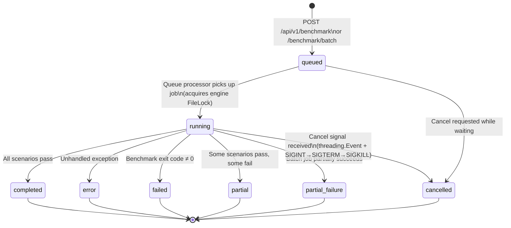

# OpenSearch Benchmark Automation — Architecture Wiki

## Table of Contents
1. [System Overview](#system-overview)
2. [Architecture Diagram](#architecture-diagram)
3. [Job Lifecycle State Diagram](#job-lifecycle-state-diagram)
4. [Component Interactions](#component-interactions)
5. [Data Flow](#data-flow)
6. [Configuration System](#configuration-system)
7. [Directory Structure](#directory-structure)
8. [Quick Reference](#quick-reference)

---

## System Overview

The OpenSearch Benchmark Automation is a cloud-native REST API service that orchestrates vector search benchmarks across three engines — **FAISS**, **JVector**, and **Lucene** — running as separate Kubernetes worker pods. A central API server pod handles all user interaction, routing, and job tracking. Each worker pod independently executes benchmarks against its dedicated OpenSearch cluster.

### Key Components

| Component | Pod | Responsibility |
|---|---|---|
| **API Server** | `opensearch-benchmark-api-server` | Web UI, job routing, job list, fan-out to workers |
| **Worker — JVector** | `opensearch-benchmark-worker-jvector-0` | Queue processing and execution for JVector engine |
| **Worker — FAISS** | `opensearch-benchmark-worker-faiss-0` | Queue processing and execution for FAISS engine |
| **Worker — Lucene** | `opensearch-benchmark-worker-lucene-0` | Queue processing and execution for Lucene engine |
| **BenchmarkRunner** | (in each worker) | Invokes `opensearch-benchmark` CLI, manages profiling and metrics |
| **ConfigLoader** | (in each worker) | Reads `config/datasets.yaml`, resolves workload paths and params |

---

## Architecture Diagram

```
┌─────────────────────────────────────────────────────────────────────────────┐
│                              USER / BROWSER                                 │
│                         http://34.132.114.18/                               │
└───────────────────────────────┬─────────────────────────────────────────────┘
                                │  HTTP (LoadBalancer :80 → :8080)
┌───────────────────────────────▼─────────────────────────────────────────────┐
│                    API SERVER POD  (WORKER_ENGINES=none)                    │
│   opensearch-benchmark-api-server   namespace: benchmark-api                │
├─────────────────────────────────────────────────────────────────────────────┤
│                                                                             │
│  app.py (Flask / Gunicorn, 2 workers × 4 threads)                          │
│  ┌───────────────────────────────────────────────────────────────┐          │
│  │  Web UI   GET /                  → web/index.html             │          │
│  │  Discover GET /api/v1/discover   → fan-out to all workers     │          │
│  │  Submit   POST /api/v1/benchmark → proxy to engine worker     │          │
│  │  Batch    POST /api/v1/benchmark/batch → proxy to engine      │          │
│  │  Status   GET  /api/v1/benchmark/<id>  → proxy to engine      │          │
│  │  Cancel   POST /api/v1/benchmark/<id>/cancel?engine=<e>       │          │
│  │  List     GET  /api/v1/benchmark → fan-out, merge & sort      │          │
│  │  Sync     POST /api/v1/sync      → proxy to all workers       │          │
│  │  Health   GET  /health           → local SQLite check         │          │
│  └───────────────────────────────────────────────────────────────┘          │
│                                                                             │
│  Storage: benchmark-api-db-storage PVC  (/data/jobs.db + /data/results)    │
│                                                                             │
└──────────┬──────────────────────┬───────────────────────┬───────────────────┘
           │ in-cluster DNS       │                       │
           ▼                      ▼                       ▼
 worker-jvector-0.…    worker-faiss-0.…       worker-lucene-0.…
 :8080                 :8080                  :8080
┌──────────────────┐  ┌──────────────────┐  ┌──────────────────┐
│  WORKER — JVEC   │  │  WORKER — FAISS  │  │  WORKER — LUCENE │
│ WORKER_ENGINES=  │  │ WORKER_ENGINES=  │  │ WORKER_ENGINES=  │
│   jvector        │  │   faiss          │  │   lucene         │
├──────────────────┤  ├──────────────────┤  ├──────────────────┤
│ app.py           │  │ app.py           │  │ app.py           │
│ ┌──────────────┐ │  │ ┌──────────────┐ │  │ ┌──────────────┐ │
│ │ SQLite DB    │ │  │ │ SQLite DB    │ │  │ │ SQLite DB    │ │
│ │ jobs.db      │ │  │ │ jobs.db      │ │  │ │ jobs.db      │ │
│ └──────────────┘ │  │ └──────────────┘ │  │ └──────────────┘ │
│ ┌──────────────┐ │  │ ┌──────────────┐ │  │ ┌──────────────┐ │
│ │Queue         │ │  │ │Queue         │ │  │ │Queue         │ │
│ │Processor     │ │  │ │Processor     │ │  │ │Processor     │ │
│ │(background   │ │  │ │(background   │ │  │ │(background   │ │
│ │ thread)      │ │  │ │ thread)      │ │  │ │ thread)      │ │
│ └──────────────┘ │  │ └──────────────┘ │  │ └──────────────┘ │
│ ┌──────────────┐ │  │ ┌──────────────┐ │  │ ┌──────────────┐ │
│ │Benchmark     │ │  │ │Benchmark     │ │  │ │Benchmark     │ │
│ │Runner        │ │  │ │Runner        │ │  │ │Runner        │ │
│ └──────────────┘ │  │ └──────────────┘ │  │ └──────────────┘ │
│                  │  │                  │  │                  │
│ PVC: worker-     │  │ PVC: worker-     │  │ PVC: worker-     │
│ storage-jvector  │  │ storage-faiss    │  │ storage-lucene   │
│ /datasets        │  │ /datasets        │  │ /datasets        │
│ /results         │  │ /results         │  │ /results         │
│ /workspace       │  │ /workspace       │  │ /workspace       │
└────────┬─────────┘  └────────┬─────────┘  └────────┬─────────┘
         │                     │                      │
         ▼                     ▼                      ▼
  OpenSearch                OpenSearch             OpenSearch
  JVector Cluster           Standard Cluster       Standard Cluster
  (jvector-data-nodes)      (standard-data-nodes)  (standard-data-nodes)
```

### Routing Rules (API Server)

The API server runs with `WORKER_ENGINES=none`, so it **never** processes jobs itself. Every job request is forwarded to the correct worker pod over in-cluster DNS:

```
http://opensearch-benchmark-worker-{engine}-0
  .opensearch-benchmark-worker-{engine}
  .benchmark-api.svc.cluster.local:8080
```

For requests that include `?engine=<engine>`, routing is direct. For requests without an engine param (legacy paths), the server probes all three workers in parallel via `_engine_from_job_id()` to find the owner.

---

## Job Lifecycle State Diagram


```mermaid
stateDiagram-v2
    [*] --> queued : POST /api/v1/benchmark\nor /benchmark/batch

    queued --> running : Queue processor picks up job\n(acquires engine FileLock)
    queued --> cancelled : Cancel requested while waiting

    running --> completed : All scenarios pass
    running --> error : Unhandled exception
    running --> failed : Benchmark exit code ≠ 0
    running --> partial : Some scenarios pass, some fail
    running --> partial_failure : Batch job partially succeeds
    running --> cancelled : Cancel signal received\n(threading.Event + SIGINT→SIGTERM→SIGKILL)

    completed --> [*]
    cancelled --> [*]
    error --> [*]
    failed --> [*]
    partial --> [*]
    partial_failure --> [*]
```

### Queue Processor Loop (per worker, per engine)

```
startup
  └─► _start_processors_for_pending_engines()
        └─► executor.submit(process_engine_queue, engine)  ← background thread

process_engine_queue(engine):
  loop forever:
    job = get_next_queued_job(engine)        # ORDER BY queue_position, created_at
    if no job → sleep 5s, continue

    skip if job already in TERMINAL_STATUSES  # cancelled while queued

    acquire FileLock(/workspace/locks/{engine}.lock)  # blocks until free
      re-check if cancelled while waiting
      update status → 'running'
      create cancel_event, register in _cancel_events[job_id]

      if batch job  → process_batch_job()
      if single job → benchmark_runner.run_benchmark()

      save result, commit to git (if GIT_COMMIT_RESULTS=true)
    release FileLock
```

### Cancellation Flow

```
UI: Cancel button  →  POST /api/v1/benchmark/{id}/cancel?engine={engine}
                                │
                                ▼
                    cancel_job() on the worker pod
                                │
                    ┌───────────┴──────────────┐
                    │ status == 'queued'        │ status == 'running'
                    │ Mark cancelled in DB      │ Mark cancelled in DB
                    │ (no process to kill)      │ Set cancel_event (threading.Event)
                    └───────────────────────────┤ benchmark_runner.cancel(job_id)
                                                │   → SIGINT → SIGTERM → SIGKILL
                                                └─────────────────────────────────
```

---

## Component Interactions

### 1. Job Submission Flow

```
Browser                 API Server              Worker Pod
   │                        │                       │
   │  POST /benchmark        │                       │
   │  {dataset, engine,      │                       │
   │   scenarios}            │                       │
   │────────────────────────▶│                       │
   │                         │  _proxy(engine, ...)  │
   │                         │──────────────────────▶│
   │                         │                       │ save_job() → jobs.db
   │                         │                       │ ensure_processor_running()
   │                         │   202 Accepted        │
   │                         │◀──────────────────────│
   │  {job_id, status}       │                       │
   │◀────────────────────────│                       │
   │                         │                       │
   │  GET /benchmark/{id}    │                       │
   │────────────────────────▶│                       │
   │                         │  _proxy(engine, ...)  │
   │                         │──────────────────────▶│
   │                         │   job JSON            │
   │                         │◀──────────────────────│
   │  {status, result, ...}  │                       │
   │◀────────────────────────│                       │
```

### 2. BenchmarkRunner Execution Flow

```
process_engine_queue
    │
    └─► benchmark_runner.run_benchmark(dataset, engine, scenario, ...)
              │
              ├─ config_loader.get_target_host(engine)     → OpenSearch endpoint
              ├─ config_loader.get_workload_path(dataset)  → /datasets/workloads/...
              ├─ build params: common_params + engine_params + procedure_params
              │
              ├─ [if parameter sweep]
              │    for each sweep value:
              │      osb CLI → opensearch-benchmark execute-test \
              │                  --workload-path=... \
              │                  --test-procedure=... \
              │                  --workload-params=...
              │
              ├─ [if single run]
              │    osb CLI → opensearch-benchmark execute-test ...
              │
              ├─ collect GKE metrics (k8s_metrics_collector.py)
              ├─ save index snapshot (index_snapshot.json)
              └─ return result dict → saved to jobs.db
```

### 3. Git Commit-Back Flow

```
job completes
    │
    └─► executor.submit(_commit_results_to_git, job_id, status)
              │  (background thread, controlled by GIT_COMMIT_RESULTS=true)
              │
              ├─ git reset HEAD          (clean staged index)
              ├─ git pull --rebase       (sync remote if branch exists)
              ├─ git add {job_id}/
              ├─ git commit -m "results: add {job_id} [{status}]"
              └─ git push origin main
```

---

## Data Flow

```
User submits job
      │
      ▼
API Server (proxy) ──────────────────────────────────────────────┐
      │                                                           │
      ▼                                                           ▼
Worker Pod                                             config/datasets.yaml
      │                                                   (ConfigLoader)
      ├─► jobs.db (SQLite)                                        │
      │     status: queued → running → completed                  │
      │                                                           │
      ├─► BenchmarkRunner ◀──────────────────────────────────────┘
      │     │
      │     ├─► opensearch-benchmark CLI subprocess
      │     │     writes → /results/{job_id}/{dataset}-{engine}/
      │     │                ├── {sweep}/test_run.json
      │     │                ├── {sweep}/gke_metrics.json
      │     │                └── {sweep}/index_snapshot.json
      │     │
      │     └─► k8s_metrics_collector.py
      │           polls GMP / kube-state-metrics
      │
      └─► git push → results repo (if GIT_COMMIT_RESULTS=true)
```

---

## Configuration System

### datasets.yaml Structure

Each entry in `config/datasets.yaml` defines a dataset and all the information needed to run it across engines:

```yaml
datasets:
  cohere-wiki-en-768:
    dimension: 768
    format: hdf5
    space_type: "innerproduct"
    description: "..."
    workload: "vectorsearch"         # must match folder name in opensearch-benchmark-workloads

    supported_corpus_sizes: ["1m", "5m", "10m"]

    # GCS-backed corpus files seeded onto worker PVCs by Jenkins
    gcs_cache_files:
      - corpus_size: "5m"
        gcs_path: "gs://opensearch-benchmark-datasets/..."
        target_path: "/datasets/opensearch-benchmark/.osb/benchmarks/data/cohere-5m/cohere-5m.hdf5"

    # Parameters shared across all scenarios and engines
    common_params:
      target_index_name: "cohere-wiki-en-768-{{corpus_size}}"
      target_field_name: "target_field"
      id_field_name: "_id"
      corpus_name: "cohere-{{corpus_size}}"

    # Engine identity injected into every run for this engine
    engine_params:
      faiss:
        engine: "faiss"
      lucene:
        engine: "lucene"
      jvector:
        engine: "jvector"

    # Available test procedures (scenarios)
    test_procedures:
      - name: "create-index"
        params:
          target_index_body: "indices/index.json"
          target_index_dimension: 768
          target_index_space_type: "innerproduct"
          hnsw_ef_construction: 256
          hnsw_m: 32
          # ...
        engine_params:              # procedure-level engine overrides
          jvector:
            method_name: "disk_ann"
            mode: "in_memory"
          faiss:
            method_name: "hnsw"
          lucene:
            method_name: "hnsw"

      - name: "bulk-ingest-data"
        params:
          target_index_bulk_size: 500
          target_index_bulk_index_data_set_format: "hdf5"
          target_index_bulk_index_data_set_corpus: "{{corpus_name}}"
          target_index_bulk_indexing_clients: 8

      - name: "vector-search"
        params:
          query_data_set_format: "hdf5"
          query_data_set_corpus: "{{corpus_name}}"
          number_of_repetitions: 1000
          warmup_time_period: 60
          time_period: 300
          hnsw_ef_search: 128
        parameter_sweeps:           # runs once per entry, varying search_clients
          - params: { search_clients: 4 }
          - params: { search_clients: 8 }
          - params: { search_clients: 10 }
          - params: { search_clients: 12 }
          - params: { search_clients: 16 }
```

### Configuration Hierarchy (per run)

```
Priority (highest → lowest):
1. Per-test params in batch job request  (test.params)
2. Procedure-level params               (test_procedures[n].params)
3. Engine-specific params               (engine_params.{engine})
4. Common params                        (common_params)
5. Workload defaults
```

### Key Config Files

| File | Purpose |
|---|---|
| `config/datasets.yaml` | All dataset definitions, engine targets, test procedures |
| `config/cluster.yaml` | Cluster endpoint, auth, profiling/metrics/telemetry flags |
| `gke-manifest/opensearch-benchmark-worker-template.yaml` | StatefulSet template for worker pods |
| `gke-manifest/opensearch-benchmark-api-server.yaml` | API server Deployment + LoadBalancer Service |

---

## Directory Structure

```
opensearch-benchmark-automation/
│
├── cloud-service/
│   ├── app.py                    # Flask API — routing, job queue, cancel, proxy
│   ├── benchmark_runner.py       # Executes opensearch-benchmark CLI subprocess
│   ├── config_loader.py          # Reads datasets.yaml, resolves paths & params
│   ├── k8s_metrics_collector.py  # Polls GKE / GMP metrics during runs
│   ├── requirements.txt
│   └── web/
│       ├── index.html            # Job dashboard (submit, list, cancel)
│       ├── results.html          # Per-job results viewer
│       └── compare.html          # Cross-engine comparison UI
│
├── config/
│   ├── datasets.yaml             # Dataset definitions + engine targets
│   └── cluster.yaml              # Cluster connection + feature flags
│
├── gke-manifest/
│   ├── opensearch-benchmark-api-server.yaml        # API server Deployment
│   ├── opensearch-benchmark-worker-template.yaml   # Worker StatefulSet template
│   ├── benchmark-worker-pvcs.yaml                  # PVCs per engine
│   ├── opensearch-jvector-*.yaml                   # JVector OpenSearch cluster
│   ├── opensearch-standard-*.yaml                  # Standard OpenSearch cluster
│   └── deploy-all-clusters.sh                      # Deploy everything
│
├── scripts/
│   └── test/                     # Test scripts
│
└── ARCHITECTURE_WIKI.md          # This file
```

### Worker Pod Volume Layout

Each worker mounts a single PVC (`benchmark-worker-storage-{engine}`) at three sub-paths:

```
/datasets     ← workload data, HDF5 files, opensearch-benchmark home
/results      ← benchmark output (test_run.json, metrics, snapshots)
/workspace    ← automation repo clone (config/, cloud-service/), jobs.db, FileLocks
```

---

## Quick Reference

### API Endpoints

| Method | Path | Description |
|---|---|---|
| `GET` | `/` | Web UI |
| `GET` | `/health` | Liveness / job counts |
| `GET` | `/api/v1/discover` | List datasets, engines, procedures |
| `POST` | `/api/v1/benchmark` | Submit a single-scenario job |
| `POST` | `/api/v1/benchmark/batch` | Submit a multi-test batch job |
| `GET` | `/api/v1/benchmark` | List all jobs (fan-out across workers) |
| `GET` | `/api/v1/benchmark/{id}?engine={e}` | Get job status |
| `POST` | `/api/v1/benchmark/{id}/cancel?engine={e}` | Cancel queued or running job |
| `DELETE` | `/api/v1/benchmark/{id}?engine={e}` | Delete job record |
| `GET` | `/api/v1/benchmark/{id}/results?engine={e}` | Fetch parsed result artifacts |
| `GET` | `/api/v1/benchmark/{id}/live-status?engine={e}` | Live status during run |
| `POST` | `/api/v1/sync` | Git pull + config reload on all workers |

### Useful kubectl Commands

```bash
# View all benchmark pods
kubectl get pods -n benchmark-api

# Tail API server logs
kubectl logs -n benchmark-api -l component=api-server -f

# Tail a specific worker
kubectl logs -n benchmark-api opensearch-benchmark-worker-jvector-0 -f

# Shell into a worker
kubectl exec -it -n benchmark-api opensearch-benchmark-worker-lucene-0 -- bash

# Manually push updated web UI without pod restart
kubectl cp cloud-service/web/index.html \
  benchmark-api/<api-server-pod>:/app/web/index.html

# Deploy all workers from template
for ENGINE in jvector faiss lucene; do
  ENGINE=$ENGINE envsubst < gke-manifest/opensearch-benchmark-worker-template.yaml \
    | kubectl apply -n benchmark-api -f -
done
```

### Troubleshooting

```
Symptom: Job stuck in 'queued' for an engine
  └─► kubectl get pods -n benchmark-api | grep <engine>
      → Pod missing? Deploy it with the worker template.
      → Pod CrashLooping? kubectl logs -n benchmark-api worker-<engine>-0

Symptom: Cancel button returns 404
  └─► Confirm ?engine= param is included in the cancel request
  └─► Check that the worker pod for that engine is Running

Symptom: Job shows 'running' but no progress
  └─► kubectl exec into the worker pod
  └─► Check ps aux for opensearch-benchmark process
  └─► Check /workspace/locks/{engine}.lock — stale lock from crashed pod?
      → rm /workspace/locks/{engine}.lock  (then let the queue processor retry)

Symptom: Results not showing in UI after completion
  └─► GET /api/v1/benchmark/{id}/results?engine={engine}
  └─► Check /results/{job_id}/ on the worker PVC
```
